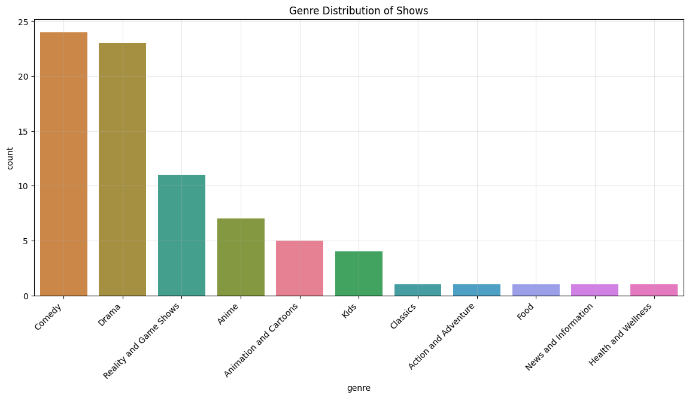
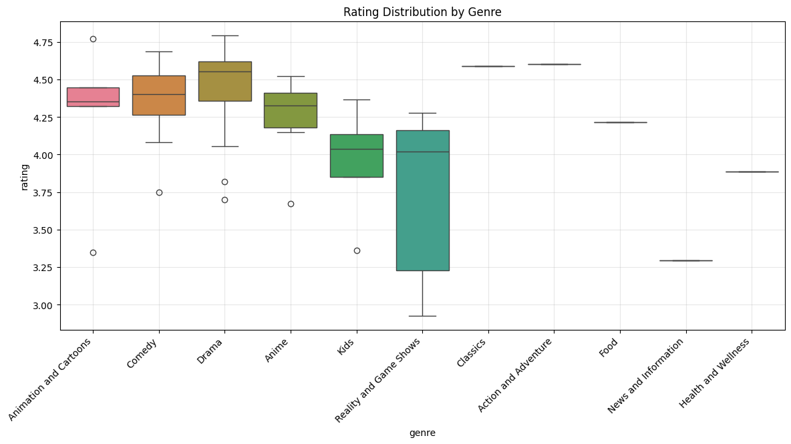
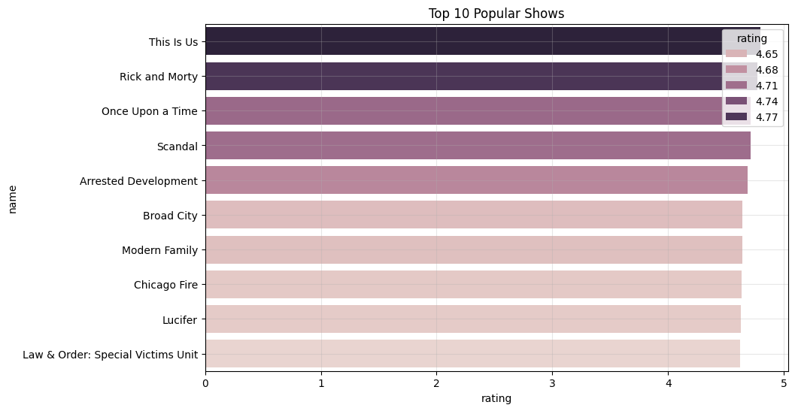
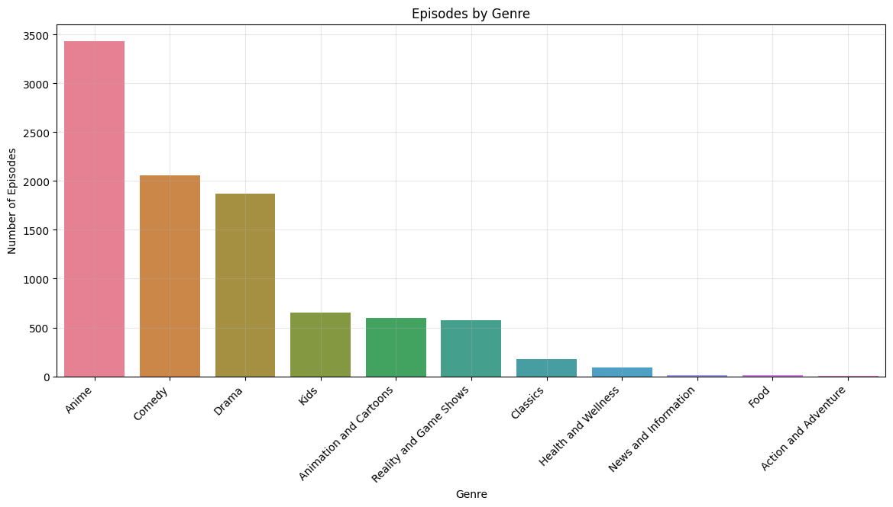
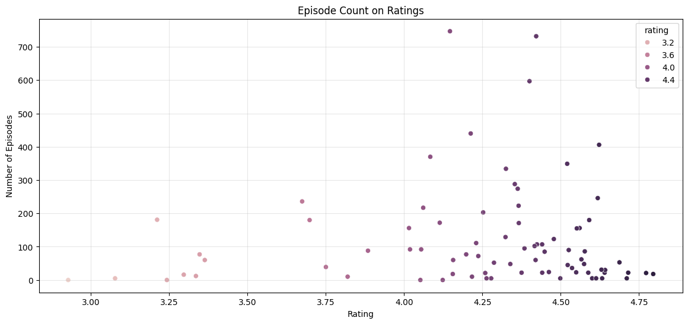

# Hulu Marketing Insights
#### In this data analytics project, I delved into Hulu's vast viewership data to identify top-performing television shows and discern prevalent genre trends. By leveraging these ratings insights, I developed strategic recommendations to optimize Hulu's marketing approach. This project aimed to align marketing strategies with viewer preferences, utilizing data-driven tactics to enhance the platform's overall content promotion and audience engagement. 

## Background

Hulu is an American subscription streaming service owned by The Walt Disney Company. Launched on October 29, 2007, it was initially established as a joint venture between News Corporation and NBCUniversal, among others. Hulu offers an expansive slate of live and on-demand entertainment, both in and outside the home, through a wide array of subscription options. As of September 30, 2023, it has 48.5 million users. Hulu’s streaming library includes last night’s episodes from most major network shows, full seasons of hit shows, award-winning original series, documentaries, movies, and more.

## Business Objectives

    1. Which television shows exhibit the highest ratings on Hulu?
    2. What genres consistently demonstrate elevated ratings on Hulu?
    3. How could these trends help influence Hulu's marketing strategy?

## Data Source

The dataset used is publicly available on [Kaggle: Hulu Popular Shows Dataset](https://www.kaggle.com/datasets/thedevastator/hulu-popular-shows-dataset)

### Episodes Count Analysis

* The average number of episodes for the shows in the dataset is approximately 120.16.
* The standard deviation is quite high (154.74), indicating a significant variation in the number of episodes among different shows. Some shows may have a very high number of episodes, leading to the large spread.
* The minimum number of episodes is 0, which might be due to no data on a show or a duplicate. The maximum is 747, suggesting there are shows with a large number of episodes.
* The quartiles (25%, 50%, 75%) gives an idea of the distribution of episode counts. For example, 75% of the shows have 163 episodes or fewer.

### Rating Analysis

* The average rating across all shows is approximately 4.25.
* The standard deviation is relatively low (0.42), suggesting that the ratings are clustered around the mean. This indicates less variability in ratings compared to the variability in the number of episodes.
* The minimum rating is 2.93, and the maximum is 4.80, showing a relatively narrow range of ratings.
* The quartiles gives an idea of the spread of ratings. For instance, 75% of the shows have a rating of 4.55 or lower.

***
Genre Distribution of Shows:

In this bar chart, we are looking at the genre distribution of shows on Hulu.

* The discerned findings reveal a predominant presence of comedies and dramas within Hulu's content portfolio.
* Additionally, noteworthy instances of Reality and Game Shows, along with animated content, contribute to the diverse array of genres offered by Hulu.

***
Rating Distribution by Genre:

This box plot analysis focuses on the examination of the rating distribution by genre within the dataset.

* Findings indicate that the genres with the highest ratings include comedy, animation and cartoons, anime, and drama. It is pertinent to note that, with the exception of a few outliers, the rating ranges within each genre are comparatively modest.
* Conversely, reality and game shows exhibits a considerable degree of variance, suggesting a diverse range of reviews for shows falling under this category on Hulu. This variability in ratings implies that the reception of reality and game shows on the platform is more mixed compared to other genres.

***
Top 10 Hulu TV Shows:

The bar chart depicting the top 10 popular shows on Hulu provides a clear and visually compelling overview of the platform's most-watched content.

* "This Is Us" emerges as the frontrunner in terms of popularity, closely followed by "Rick and Morty" and "Once Upon a Time."
* The chart visually showcases the diverse range of genres represented within the top 10, including drama, animation, comedy, and crime.
* The presence of long-running series such as "Law & Order: Special Victims Unit" and "Modern Family" suggests that both enduring favorites and newer releases contribute to Hulu's top-tier content.

***
Content Availability by Genre:

The bar chart depicting the availability of content by genre to Hulu customers.

* Anime emerges as the frontrunner with shows like Naruto Shippuden which have been running for many seasons. 
* Followed by Comedy and Drama with shows like Modern Family and Law & Order: SVU having multiple season runs.

***
Content Rating by Genre:

The plot depicts how the number of episodes for a show might affect its rating.

* Many of the highest rated shows have less episodes although there are clear outliers.

## Insights

* Hulu's content portfolio is dominated by comedies and dramas. There is also a noteworthy presence of Reality and Game Shows, along with animated content, contributes to genre diversity.
* Genres with the highest ratings are comedy, animation and cartoons, anime, and drama. Considerable variance in ratings for reality and game shows suggests mixed reception.
* "This Is Us" leads as the most popular show on Hulu, followed by "Rick and Morty" and "Once Upon a Time." The top 10 shows cover a diverse range of genres, including drama, animation, and comedy. Long-running series like "Law & Order: Special Victims Unit" and "Modern Family" contribute to Hulu's popular content.

## Recommendations

* Given the popularity of comedies and dramas, Hulu should continue investing in and acquiring content in these genres. Exploring opportunities to expand the animated content library can cater to a significant audience.
* Considering the variability in ratings for reality and game shows, Hulu may want to implement stringent quality control measures for this genre. Understanding audience preferences within this category can guide content acquisition and production decisions.
* Capitalize on the popularity of top shows like "This Is Us" by featuring them prominently in promotional activities. Implement effective curation algorithms to help users discover a diverse range of content, including both long-running favorites and newer releases.

