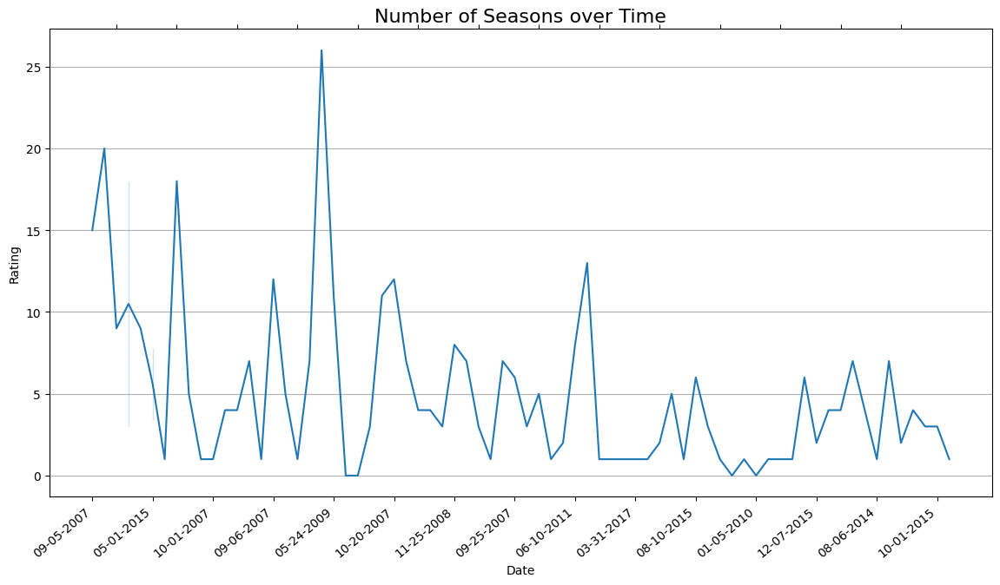

# Hulu Marketing Insights
#### In this data analytics project, I analyzed Hulu's extensive viewership data to pinpoint high-performing shows and uncover dominant genre trends. Using these insights, I crafted strategic recommendations to refine Hulu's marketing initiatives. The goal was to better align promotional efforts with audience preferences through data-driven strategies, ultimately boosting content visibility and viewer engagement.

## Background

Hulu, a subscription streaming service owned by The Walt Disney Company, was launched on October 29, 2007, originally as a joint venture between News Corporation, NBCUniversal, and others. It provides a wide range of live and on-demand entertainment through various subscription plans, both at home and on the go. As of September 30, 2023, Hulu boasts 48.5 million subscribers. Its streaming catalog includes recent episodes from major network shows, full seasons of popular series, original content, award-winning documentaries, movies, and more.

## Business Objectives

    1. How has the age of streaming influenced the strucure and number of seasons a show receives?
    2. Which television shows exhibit the highest ratings on Hulu?
    3. What genres consistently demonstrate elevated ratings on Hulu?
    4. How could these trends help influence Hulu's marketing strategy?
     

## Data Source

The dataset used is publicly available on [Kaggle: Hulu Popular Shows Dataset](https://www.kaggle.com/datasets/thedevastator/hulu-popular-shows-dataset)

### Episodes Count Analysis

* The average episode count for shows in the dataset is around 120.16 episodes.
* A high standard deviation of 154.74 suggests a wide variation in episode numbers across shows, with some having a significantly larger number of episodes
* The minimum episode count is 0, possibly due to missing data or duplicates, while the maximum is 747, indicating that some shows have a substantial number of episodes.
* The quartiles (25%, 50%, 75%) provide insight into the episode distribution, showing that 75% of the shows have 163 episodes or fewer.

### Rating Analysis

* The average rating for all shows is about 4.25.
* With a low standard deviation of 0.42, the ratings are closely clustered around the mean, indicating less variability compared to episode counts.
* The ratings range from a minimum of 2.93 to a maximum of 4.80, reflecting a relatively narrow spread.
* The quartiles provide insight into the distribution, with 75% of shows having a rating of 4.55 or lower.

***
Content Rating by Genre:

The plot illustrates the relationship between the number of episodes and show ratings.

    A noticeable trend is that many of the highest-rated shows tend to have fewer episodes, although there are notable outliers that deviate from this pattern.

***
Genre Distribution of Shows:

This bar chart highlights the genre distribution of Hulu's shows.

    Findings show that comedies and dramas make up a significant portion of Hulu's content library. This is advantageous as these genres are typically popular and cater to a broad audience, driving viewer engagement. However, this heavy focus could limit the variety for viewers who prefer other genres.
    
    Additionally, genres like Reality and Game Shows, along with animated content, also make a noteworthy contribution to the platform’s diversity. While these genres add variety and appeal to niche audiences, they may not attract the same level of consistent viewership as comedies or dramas, particularly given the variability in ratings for reality and game shows.

***
Rating Distribution by Genre:

This box plot analysis explores the distribution of ratings by genre within the dataset.

    The analysis reveals that comedy, animation and cartoons, anime, and drama are the genres with the highest ratings. The rating ranges for these genres are generally narrow, indicating consistent viewer reception, with only a few outliers.

    In contrast, reality and game shows show a much wider spread of ratings, suggesting a broader variation in how these shows are perceived. This variability indicates that reality and game shows on Hulu tend to receive more mixed reviews compared to other genres.

***
Top 10 Hulu TV Shows:

The bar chart illustrating Hulu's top 10 popular shows offers a visually clear snapshot of the platform's most-watched content.

    "This Is Us" stands out as the most popular show, with "Rick and Morty" and "Once Upon a Time" following closely behind.

    The chart highlights the diverse genres represented in the top 10, including drama, animation, comedy, and crime, reflecting the variety of content appealing to Hulu’s audience.

    Additionally, the inclusion of long-running series like "Law & Order: Special Victims Unit" and "Modern Family" suggests that both legacy shows and newer releases contribute significantly to Hulu's most-watched lineup.

***
Content Availability by Genre:

The bar chart showcasing content availability by genre for Hulu customers highlights key insights:

    Anime leads the pack, featuring long-running shows like Naruto Shippuden that span many seasons, contributing to its high availability.

    Comedy and Drama follow closely, with popular series such as Modern Family and Law & Order: SVU having multiple seasons, further bolstering the content library in these genres. This reflects Hulu's strong focus on providing viewers with extensive, long-running content across various genres.

***
Number of Seasons over Time:

Finally, we can visualize the trend of how the number of seasons for shows has decreased over time.

    This decline has become a point of contention for many viewers, as some of their favorite series are canceled prematurely, leaving storylines unresolved. This trend raises concerns about content longevity and viewer satisfaction, highlighting the need for platforms to balance new content with the continuation of established favorites.

## Insights

* Hulu's content library is primarily made up of comedies and dramas, with a significant representation of reality shows, game shows, and animated series, adding to its genre diversity.
* The highest-rated genres include comedy, animation and cartoons, anime, and drama, while reality and game shows show more varied ratings, indicating a mixed reception.
* "This Is Us" ranks as Hulu’s most popular show, followed by "Rick and Morty" and "Once Upon a Time." The top 10 shows span a variety of genres, from drama and animation to comedy, with long-running series like "Law & Order: Special Victims Unit" and "Modern Family" driving much of Hulu’s viewer engagement.

## Recommendations

* Given the strong performance of comedies and dramas, Hulu should prioritize further investments in these genres. Expanding the animated content library could also attract a significant portion of viewers who enjoy this format.
* Due to the mixed reception of reality and game shows, Hulu should consider implementing stricter quality control in this genre. Gaining deeper insights into audience preferences could help in making more informed decisions around content acquisition and production.
* To maximize the popularity of hit shows like "This Is Us," Hulu should highlight these series in marketing campaigns. Additionally, enhancing content discovery through personalized curation algorithms could help users explore a diverse array of both long-running favorites and fresh releases.

